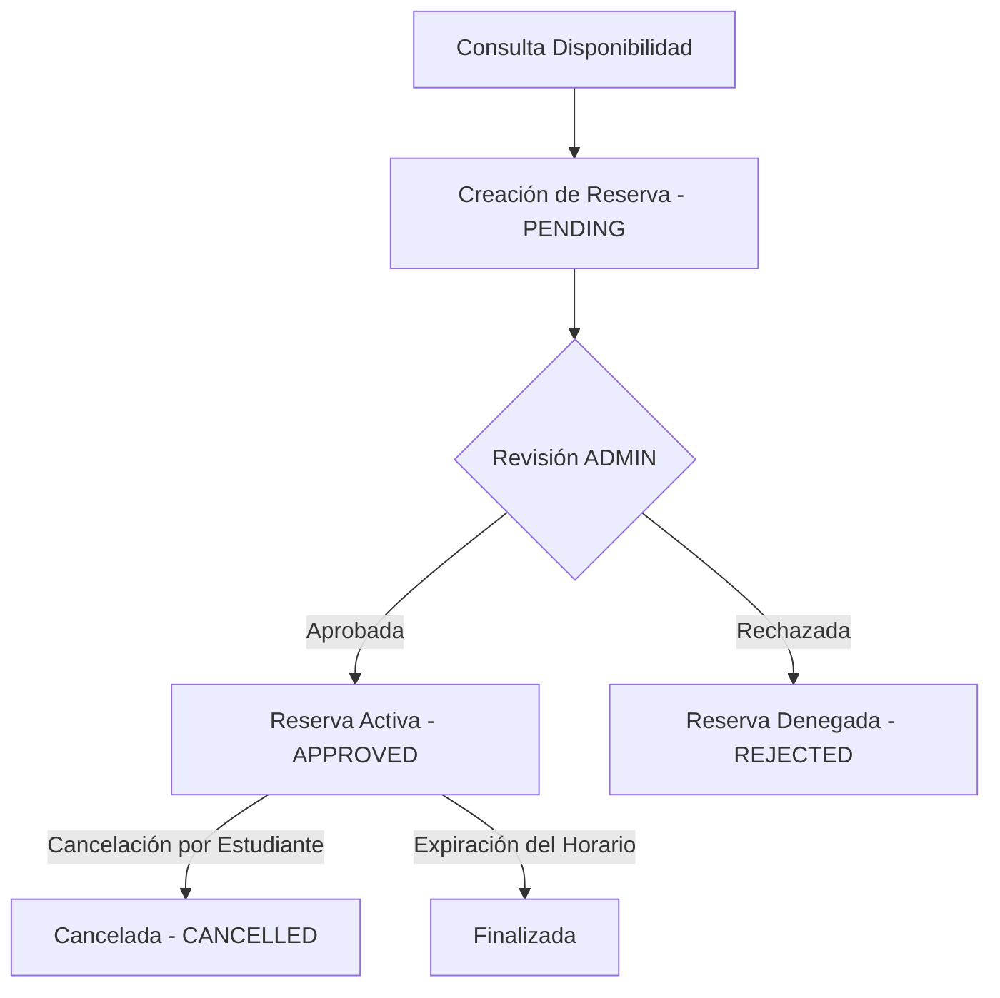

<p align="center">
	
</p>

<p align="center">
	<a href="https://www.java.com/" target="_blank"></a>
	<a href="https://spring.io/projects/spring-boot" target="_blank"></a>
	<a href="https://www.postgresql.org/" target="_blank"></a>
</p>

<p align="center">
	
	
	
	
</p>

<h1 align="center">Lab Archivística UD — Backend</h1>
<p align="center"><strong>Secure and automated API engine for the Archival Laboratory at Universidad Distrital Francisco José de Caldas.</strong></p>

---

### `> cat about.md`

Este proyecto constituye el motor de servicios REST que alimenta la plataforma del Laboratorio de Archivística de la Universidad Distrital Francisco José de Caldas. Está diseñado bajo principios de modularidad y escalabilidad para resolver de manera robusta la autenticación, control de inventario de equipos y aplicativos, gestión de documentos y flujos de reserva académica.

---

### `> cat tech_stack.json`

```json
{
  "runtime": "Java 21 (OpenJDK)",
  "framework": "Spring Boot 3.x",
  "security": "Spring Security + JWT",
  "database": "PostgreSQL",
  "migrations": "Flyway",
  "build_tool": "Maven",
  "reverse_proxy": "Apache HTTP Server"
}
```

---

### `> git status --modules`

| Módulo | Descripción | Tabla SQL |
|---|---|---|
| **Autenticación** | Registro y login seguro con tokens JWT, exclusivo para correos `@udistrital.edu.co`. | `usuarios` |
| **Equipos** | Control de inventario físico del laboratorio (marca, modelo, categoría y estado). | `equipos` |
| **Software** | Registro de licencias y documentación del software académico disponible. | `software` |
| **Aplicativos** | Catálogo informativo de herramientas archivísticas instaladas. | `aplicativos` |
| **Documentos** | Carga y descarga de archivos PDF/DOCX almacenados de forma local en el FileSystem. | `documentos` |
| **Salas y Reservas** | Control de disponibilidad semanal de salas y flujo de préstamos de la universidad. | `salas`, `horarios_salas`, `reservas_salas` |

---

### `> git log --reservation-flow`

El control de disponibilidad y préstamo de espacios sigue un ciclo de estados controlados para estudiantes y docentes universitarios:



---

### `> cat config_guide.yml`

Para iniciar el servidor localmente, debes crear el archivo `application.yml` en la ruta de recursos con la siguiente estructura base:

```yaml
spring:
  datasource:
    url: jdbc:postgresql://localhost:5432/lab_archivistica
    username: tu_usuario
    password: tu_password
  jpa:
    hibernate:
      ddl-auto: validate
  servlet:
    multipart:
      max-file-size: 20MB
app:
  jwt-secret: "clave-muy-segura-de-al-menos-32-caracteres"
  jwt-expiration: 86400000
  upload-dir: /var/www/lab-archivistica/documentos/
```

### Ejecutar proyecto

```bash
mvn clean compile
mvn spring-boot:run
```

---

### `> sonar --quality-gate`

<div align="center">


*(Métrica ilustrativa de calidad y control estático de código)*

</div>

---

<div align="center">
  <code>// Precision in every commit. Reliability in every deploy.</code>
</div>